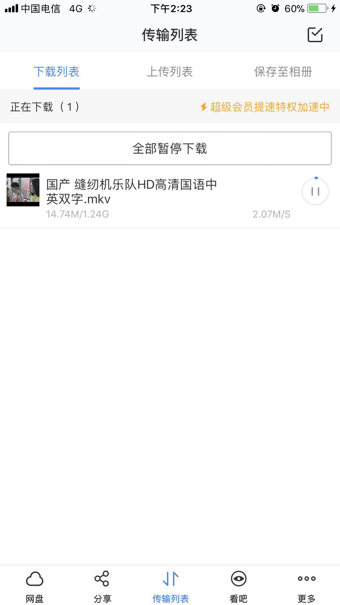
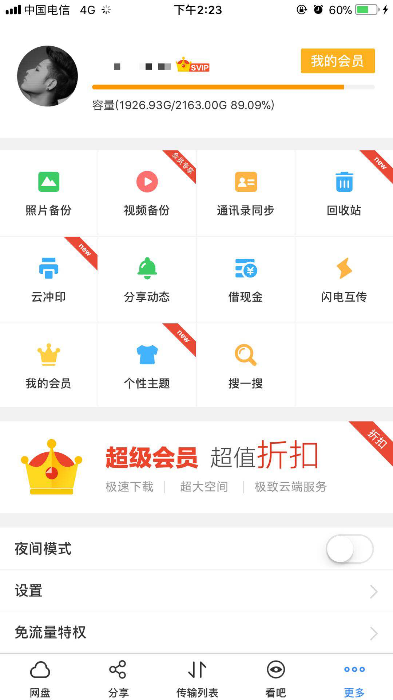

# iOS版百度云盘破解版 无需越狱~

限速破解、去广告、去更新检测。

## 使用

#### 1、安装MonkeyDev(如已安装，跳过)

- 安装最新的theos

```
sudo git clone --recursive https://github.com/theos/theos.git /opt/theos
```

- 安装ldid(如安装theos过程安装了ldid，跳过)

```
brew install ldid
```

- 指定的Xcode

```
sudo xcode-select -s /Applications/Xcode.app
```

- 执行安装命令

```
sudo /bin/sh -c "$(curl -fsSL https://raw.githubusercontent.com/AloneMonkey/MonkeyDev/master/bin/md-install)"
```

#### 2、运行工程

- 打开工程 BaiDuNetdisk/BaiDuNetdisk.xcodeproj 
- 选择证书：Targets-General-Signing
- 选择设备(不可选择模拟器，且仅支持64位设备)运行。


## 版权及免责声明

- iOS逆向实践，不可使用于商业和个人其他意图。一切问题均由个人承担，与本人无关。
- 感谢MonkeyDev的作者庆总。
- 如内容对您的权利造成了影响，请[issues](https://github.com/sunweiliang/BaiDuYunCrack/issues), 我会在第一时间进行删除。


## 截图








## 华丽的分割线

点右上角的 Start 可以领红包，不信你试试︿(￣︶￣)︿。


